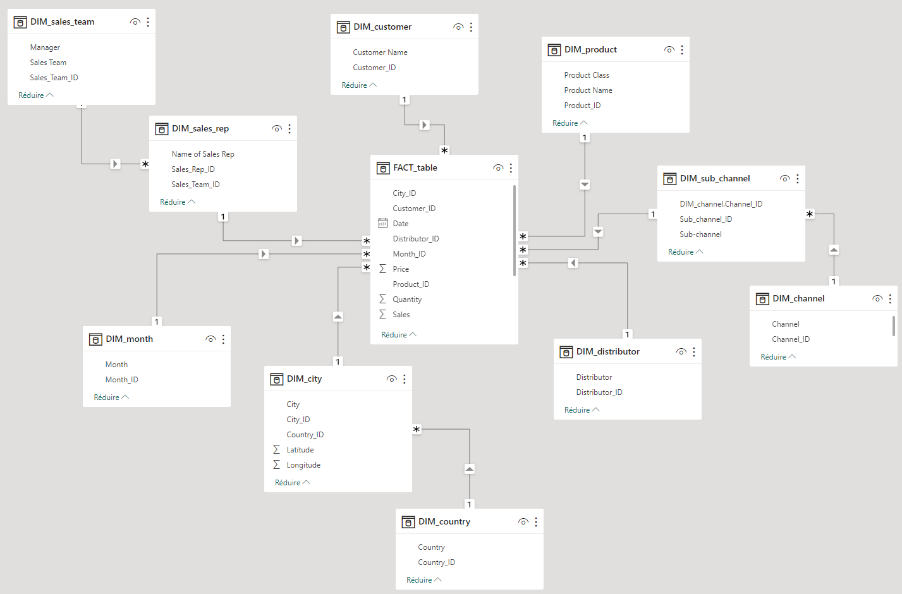

# Pharmaceutical Sales Monitoring Dashboard
A power Bi project about a marketing &amp; sales synthetic dataset 

# Data Source
The dataset used is a simulated dataset provided by [Foresight Bi](https://foresightbi.com.ng/practice-data/3-datasets-for-your-portfolio/).
This mock-dataset, simulated but realistic, presents pharmaceutical sales in two European markets: Germany and Poland. The company does not sell directly to customers but works through a network of distributors in each region.

The dashboard allow a deep dive into data analysis through several pages:
- The Executive summary page provides an overview of sales dynamics.
- The Distributor Analysis page shows the performance of the distribution network.
- The Sales Team Performance page displays the performance of each sales team.
- The Team Monitoring YTD page focuses on an individual collaborator's sales and their personal targets.
- Finally, the Sales Forecast Analysis page offers a simple visual tool for simulating sales forecasts based on simple moving averages.

# Technical considerations
- The source file is a flat .csv file. However, to optimize the operation of the table, the initial table was converted into several logically linked tables structured to respect the star schema.
- The tables with the "DIM" prefixes are the dimension tables. The table with the "FACT" prefix is the fact table (1 fact = 1 sale).
- This dashboard offers a good overview of what Power Bi is capable of in terms of graphics and dynamic display. The "team Monitoring YTD" page has been designed to be completely dynamic.

# Contacts
In case of any questions about this dashboard, or for any suggestions for improvement, please contact [arnaud.duigou@data-boost.fr](mailto:arnaud.duigou@data-boost.fr).
